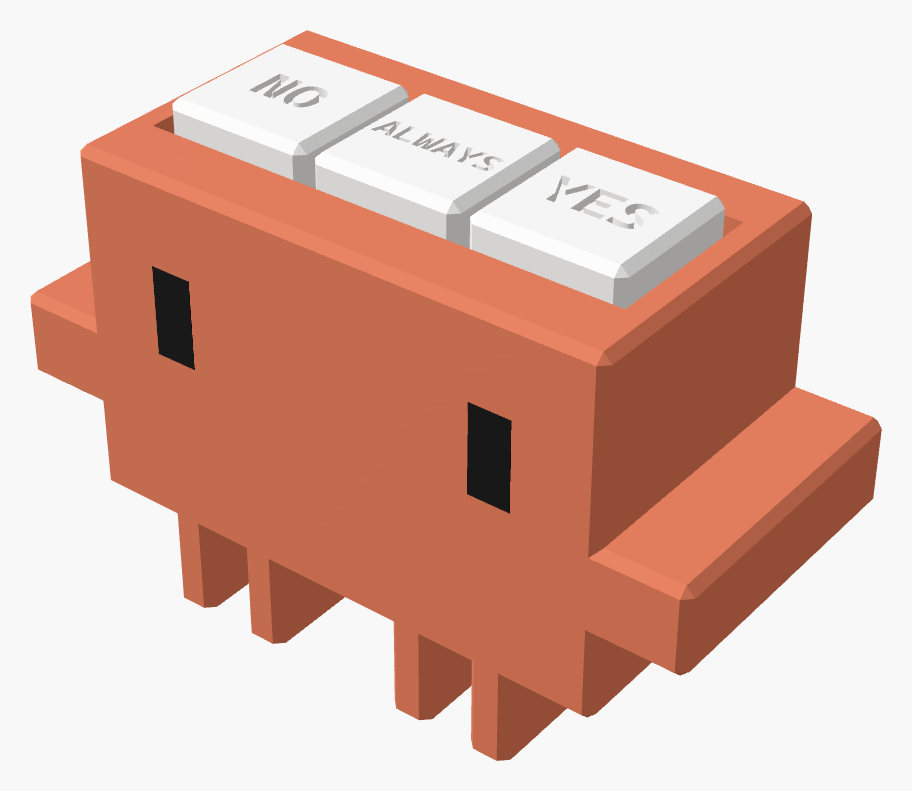

A three-key desk pad for answering coding-agent permission prompts: **No**, **Always**, **Yes**.
Built for [Claude Code](https://docs.anthropic.com/en/docs/claude-code)'s numbered prompts, but
the keys are one line to remap. Works over USB-C or Bluetooth, runs on a small LiPo, and sleeps
when you're not using it.

> **Status:** built and working. The first one is the [Clawd variant](#clawd-variant), tested on
> real hardware over USB and Bluetooth in both the desktop app and the terminal. The plain Nod
> box shares its plate, keycaps and insides, but its current body and lid haven't been printed yet.

Not affiliated with or endorsed by Anthropic.

## Keys

| Key (left to right) | Sends | In a Claude desktop app prompt |
|---|---|---|
| NO | `Esc` | Deny |
| ALWAYS | `Ctrl+Shift+Enter` | Always allow |
| YES | `Ctrl+Enter` | Allow once |

These are the shortcuts the Claude desktop app shows on its prompt buttons, tested on the real
device. The number keys shown next to the buttons are positional and change from prompt to prompt,
so Nod doesn't use them. Leave the cursor in the message box, not on the prompt card.

Some prompts (multi-step or piped commands) have only Deny and Allow once. There, ALWAYS does
nothing and YES allows once. Text you've typed in the message box isn't sent when YES approves a
prompt.

### Terminal keymap

Claude Code in a terminal numbers its options instead: 1 Yes, 2 don't ask again, 3 No (Yes/No
prompts have only 1 and 2). **Hold NO + ALWAYS for 3 s** to switch between the desktop and
terminal keymaps. The LED gives one long blink for desktop, two for terminal, and Nod remembers the
choice through sleep and power-off.

| Key | Sends | 3-option prompt | Yes/No prompt |
|---|---|---|---|
| NO | `Esc` | No | No |
| ALWAYS | `2` | Yes, don't ask again | No |
| YES | `1` | Yes | Yes |

Every key fires once, 80 ms after it's pressed (the wait tells a single press from a two-key hold). To remap, edit `CODE` (both keymaps) in [`src/main.cpp`](src/main.cpp) and the
`labels` in [`cad/case.scad`](cad/case.scad).

## How it behaves

- **USB or Bluetooth, automatically.** Plugged into a computer, it's a USB keyboard. Unplugged,
  or on a charger, it's a Bluetooth keyboard named **Nod**. Each press goes out one way only.
- **Sleep.** On battery, it deep-sleeps after 2 minutes without a press. Any key wakes it; that
  press is sent once Bluetooth reconnects (1–3 s), or dropped if that takes over 5 s, so a stale
  "Yes" never lands on a newer prompt.
- **Pairing.** It's discoverable as **Nod** whenever nothing is connected. To move it to another
  computer, hold **NO + YES** together for 3 s: it forgets every paired computer and waits for a
  new one. Remove Nod from the old computer's Bluetooth list too, or it keeps trying to reconnect.
  (Keys pressed together never send, so this can't approve a prompt by accident.)
- **LED** (the programmable one, next to the USB port):
  - quick flash: a key was sent
  - fast blink: pairing
  - short blink every second: waiting for a connection
  - short blink every 4 s: battery low (needs two resistors; see `BAT_PIN` in `src/main.cpp`)
- **Charging.** The XIAO's own red LED is on while the battery charges and goes out when it's full.
  The power switch has to be on.
- **Power switch** on the side cuts the battery. It has to be **on** for the battery to charge.

## Parts (one build)

| Part | Notes |
|---|---|
| Seeed Studio XIAO ESP32-S3 | The plain one, not Sense or Plus |
| 2.4 GHz FPC antenna, U.FL / IPEX-1 | The XIAO has no onboard antenna. ~50 × 14 mm fits the case |
| 3 × MX-style switches | 3-pin or 5-pin, plate-mount. Any feel |
| 502030 LiPo, 3.7 V ~250 mAh, **with protection circuit** | Stands on edge inside |
| SS12D00**G3** mini slide switch | Power. G3 = 3 mm slider; the case has a finger pocket sized for it. Not SS12D10/SS12F44 "5 mm knob" parts: their bodies are bigger |
| 8 × 6 × 2 mm disc magnets | Hold the lid on |
| 28–30 AWG silicone wire, heat-shrink, Kapton tape, gel superglue | |
| PLA | Case, plate, keycaps; a second colour for labels is optional |

## Wiring


Keys go to **D0 / D1 / D3** (NO / ALWAYS / YES), their other pins all to **GND**. No resistors:
the firmware uses the chip's internal pull-ups. The power switch sits in the battery's **+**
lead. Solder the battery last.

## Case

Parametric [OpenSCAD](https://openscad.org) model: [`cad/case.scad`](cad/case.scad).
Ready-to-print STLs are in `cad/stl/bevel/` (1 mm 45° edges) and `cad/stl/square/`.

| File | Print orientation |
|---|---|
| `body.stl` | As exported: top face down. Designed to print without supports (not yet test-printed) |
| `lid.stl` | Flat side down |
| `plate.stl` | Flat. Print this first to test how your switches clip in |
| `keycaps.stl` | Top face down. Labels are engraved; to fill them in a second colour, load `labels.stl` with it as one object |

The switch plate is a separate part so it prints perfectly flat; it drops into the key well and
gets a dab of glue. Glue the magnets in pairs: stack each pair first and mark the touching faces,
so the lid attracts instead of repelling.

Keycap labels use [Cascadia Code](https://github.com/microsoft/cascadia-code) Bold (free). The STLs
already have it baked in; to re-export them, install the font first, or OpenSCAD silently swaps in
a default one.

Useful knobs at the top of `case.scad`: `sw_hole` (switch fit), `cross_l`/`cross_w` (keycap fit),
`cap_proud` (how far keys stick out), `chamfer` (0 for square edges), and every `measure` value.

After changing anything, run the collision check (Windows, needs OpenSCAD and `pip install trimesh`):

```powershell
powershell -File cad/check.ps1
```

The README images are rendered from the model too: `powershell -File docs/banner/make_banner.ps1`
(add `-Target clawd` for the Clawd image; also needs `pip install pillow` and Microsoft Edge).

## Clawd variant



*Unofficial, noncommercial fan-made recreation of Clawd, the Claude Code mascot. Not affiliated with, authorized, or endorsed by Anthropic.*

The same insides and keys in a Clawd-shaped body: [`cad/clawd/clawd.scad`](cad/clawd/clawd.scad)
builds on `case.scad`. The USB port, LED holes and power switch sit on the back wall, beside
each other. STLs are in `cad/clawd/stl/`; the plate and keycaps are the same as Nod's.

| File | Print orientation |
|---|---|
| `body.stl` + `eyes.stl` | As exported: top face down. Load together for black eyes. Supports under the arms |
| `lid.stl` | Standing on its legs. Supports under the plate between the legs |

The Clawd files are licensed **CC BY-NC 4.0** (noncommercial); see [`cad/clawd/LICENSE`](cad/clawd/LICENSE).

## Firmware

[PlatformIO](https://platformio.org), Arduino framework, NimBLE.

```bash
pio test -e native     # logic tests on your PC (needs gcc)
pio run -e xiao -t upload
```

If upload can't find the board, hold **BOOT** while plugging it in, then upload again.

| File | What |
|---|---|
| `src/main.cpp` | Pins, keymap, main loop, sleep |
| `src/usb_out.cpp`, `src/ble_out.cpp` | USB and Bluetooth keyboards (separate files: their headers clash) |
| `include/keys.h` | Debounce, wake-key and sleep decisions: pure logic, unit tested |

## License

Nod (firmware, case, docs): [MIT](LICENSE).
The Clawd variant in `cad/clawd/`: [CC BY-NC 4.0](cad/clawd/LICENSE), noncommercial use only.
