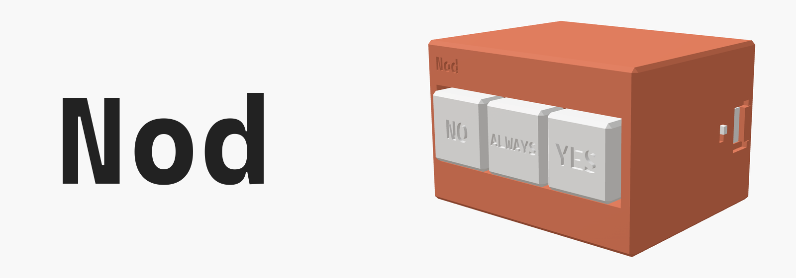
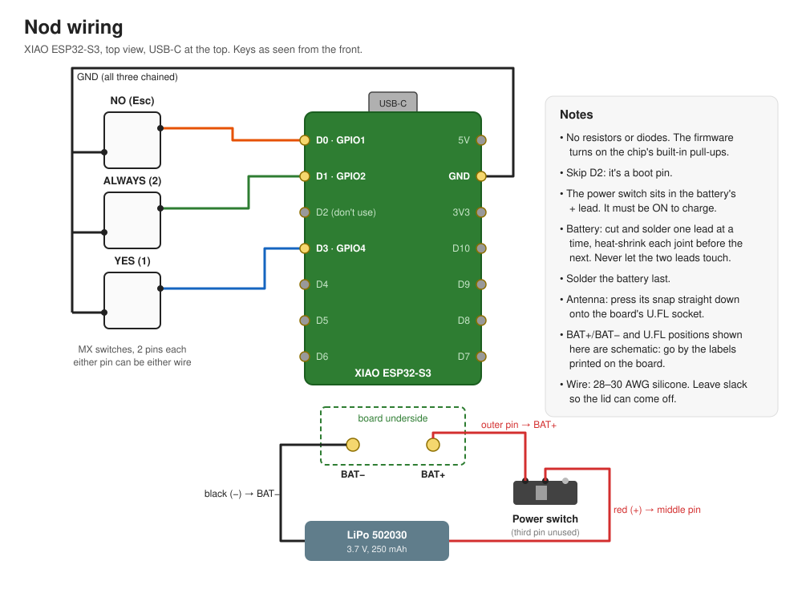

A three-key desk pad for answering coding-agent permission prompts: **No**, **Always**, **Yes**.
Built for [Claude Code](https://docs.anthropic.com/en/docs/claude-code)'s numbered prompts, but
the keys are one line to remap. Works over USB-C or Bluetooth, runs on a small LiPo, and sleeps
when you're not using it.

> **Status:** designed and compiled, not yet built. The firmware builds and its logic is unit
> tested; the case passes a collision check against stand-ins for every part. Values marked
> `measure` in `cad/case.scad` are from datasheets and listings and get tuned on the first build.

Not affiliated with or endorsed by Anthropic.

## Keys

| Key (left to right) | Sends | In a Claude Code prompt |
|---|---|---|
| NO | `Esc` | Deny |
| ALWAYS | `2` | Yes, and don't ask again (for file edits: allow all edits this session) |
| YES | `Enter` | Yes |

The same keys work in the terminal and in the Claude desktop app. Number keys don't: they pick by
position, and `1` is Yes in the terminal but Deny in the desktop app. In the desktop app the keys
go to the focused window, so leave the cursor in the message box, not on the prompt card.

Prompts with only two options have no "always": there, ALWAYS (`2`) picks the second option,
which is Confirm in the desktop app and No in the terminal. NO and YES behave the same everywhere.

With no prompt open, the keys act like normal keys: `Esc` interrupts Claude, `2` types a 2,
`Enter` sends whatever is in the message box.

Every key fires on press, once. To remap, edit `CODE[]` in [`src/main.cpp`](src/main.cpp) and the
`labels` in [`cad/case.scad`](cad/case.scad).

## How it behaves

- **USB or Bluetooth, automatically.** Plugged into a computer, it's a USB keyboard. Unplugged,
  or on a charger, it's a Bluetooth keyboard named **Nod**. Each press goes out one way only.
- **Sleep.** On battery, it deep-sleeps after 5 minutes without a press. Any key wakes it; that
  press is sent once Bluetooth reconnects (1–3 s), or dropped if that takes over 5 s, so a stale
  "Yes" never lands on a newer prompt.
- **LED.** A short blink every second means it's waiting for a connection.
- **Power switch** on the side cuts the battery. It has to be **on** for the battery to charge.

## Parts (one build)

| Part | Notes |
|---|---|
| Seeed Studio XIAO ESP32-S3 | The plain one, not Sense or Plus |
| 2.4 GHz FPC antenna, U.FL / IPEX-1 | The XIAO has no onboard antenna. ~50 × 14 mm fits the case |
| 3 × MX-style switches | 3-pin or 5-pin, plate-mount. Any feel |
| 502030 LiPo, 3.7 V ~250 mAh, **with protection circuit** | Stands on edge inside |
| SS12D00G3-style mini slide switch | Power |
| 8 × 6 × 2 mm disc magnets | Hold the lid on |
| 28–30 AWG silicone wire, heat-shrink, Kapton tape, gel superglue | |
| PLA | Case, plate, keycaps; a second colour for labels is optional |

## Wiring



Keys go to **D0 / D1 / D3** (NO / ALWAYS / YES), their other pins all to **GND**. No resistors:
the firmware uses the chip's internal pull-ups. The power switch sits in the battery's **+**
lead. Solder the battery last.

## Case

Parametric [OpenSCAD](https://openscad.org) model: [`cad/case.scad`](cad/case.scad).
Ready-to-print STLs are in `cad/stl/bevel/` (1 mm 45° edges) and `cad/stl/square/`.

| File | Print orientation |
|---|---|
| `body.stl` | As exported: top face down. Designed to print without supports (not yet test-printed) |
| `lid.stl` | Flat side down |
| `plate.stl` | Flat. Print this first to test how your switches clip in |
| `keycaps.stl` + `labels.stl` | Load together as one object for two-colour labels |

The switch plate is a separate part so it prints perfectly flat; it drops into the key well and
gets a dab of glue. Glue the magnets in pairs: stack each pair first and mark the touching faces,
so the lid attracts instead of repelling.

Keycap labels use [Cascadia Code](https://github.com/microsoft/cascadia-code) Bold (free). The STLs
already have it baked in; to re-export them, install the font first, or OpenSCAD silently swaps in
a default one.

Useful knobs at the top of `case.scad`: `sw_hole` (switch fit), `cross_l`/`cross_w` (keycap fit),
`cap_proud` (how far keys stick out), `chamfer` (0 for square edges), and every `measure` value.

After changing anything, run the collision check (Windows, needs OpenSCAD and `pip install trimesh`):

```powershell
powershell -File cad/check.ps1
```

## Firmware

[PlatformIO](https://platformio.org), Arduino framework, NimBLE.

```bash
pio test -e native     # logic tests on your PC (needs gcc)
pio run -e xiao -t upload
```

If upload can't find the board, hold **BOOT** while plugging it in, then upload again.

| File | What |
|---|---|
| `src/main.cpp` | Pins, keymap, main loop, sleep |
| `src/usb_out.cpp`, `src/ble_out.cpp` | USB and Bluetooth keyboards (separate files: their headers clash) |
| `include/keys.h` | Debounce, wake-key and sleep decisions: pure logic, unit tested |

## License

[MIT](LICENSE)
